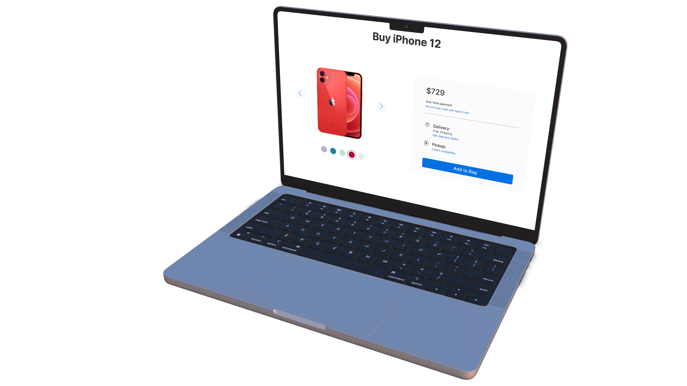

<br>

# This project is live [here👈](https://feasiblecomponents-imageslider.netlify.app/)

<br>

## This project mainly focuses on image sliding, and I made this project a bit more interactive by animating some components.

<br>

## **Language & Pre-processor :**

<br>

- ### Language :
  ```bash
  HTML5, CSS3, JS(es6)
  ```
- ### Pre-processor :
  ```bash
  SASS, TypeScript
  ```

<br>

## **Tools & Technology :**

- ```bash
     Adobe Photoshop, mock, Figma, Dev-Tools
  ```
