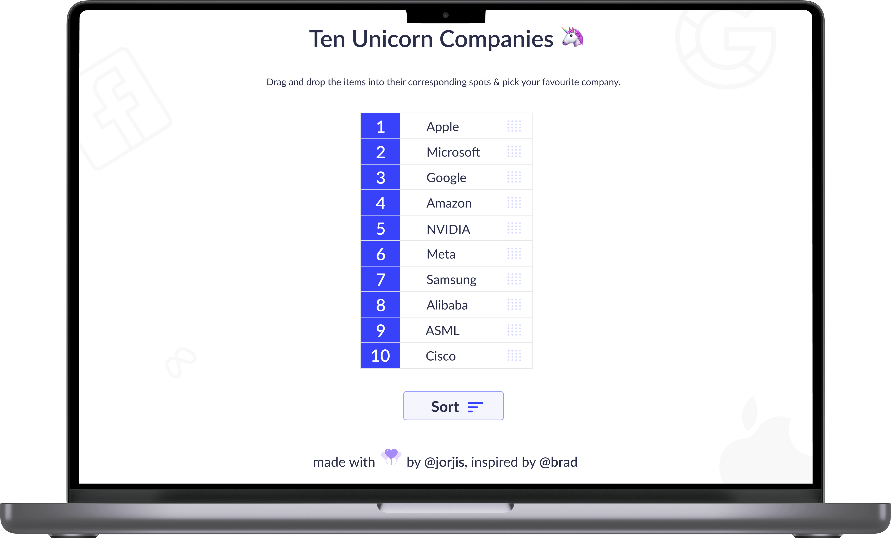

## watch this project live [here 👈](https://feasiblecomponents-dragndrop.netlify.app/)

## the project was inspired from [that 👈](https://vanillawebprojects.com/projects/sortable-list/)

<br>

# Improvements :

- Super Clean **`UI`**
- Optimization :
  - get rid of an extra event `[dragenter]`
  - Memory Optimization `- remove an unnecessary array`
- add `scribbles`

<br>

# Language & Pre-processors

- ## Language :

  - ```bash
      HTML5, CSS3, Js(es6)
    ```

- ## Pre-processors:
  - ```bash
      SCSS, TypeScript
    ```

<br>

# Tools & Technology :

- ```bash
     Adobe Illustrator, Figma, Netlify
  ```

<br>

# **Script Highlight :**

- ```javascript
    drag-Api:
    - events: dragover, dragleave,drop
    Basic DOM Selector,
    Some High Order Functions

  ```
